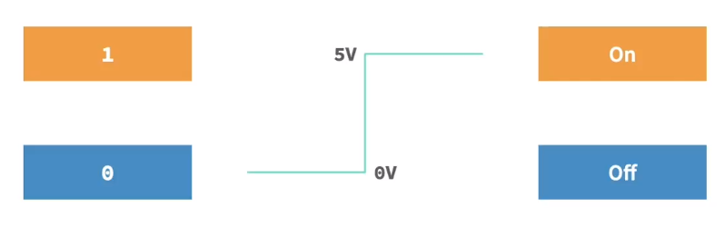
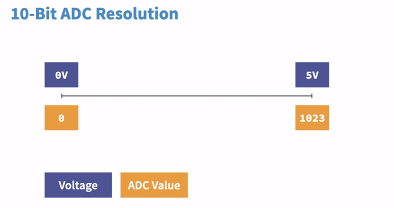

# Arduino: Foundations

Welcome to the foundational guide on Arduino. This guide will walk you through the core components and principles of Arduino, giving you both theoretical knowledge and hands-on experience with real-world applications.

## What is an Arduino?

Arduino is an open-source electronics platform based on easy-to-use hardware and software. It consists of both a physical programmable circuit board (often referred to as a microcontroller) and a piece of software, called the IDE (Integrated Development Environment), which is used to write and upload code to the Arduino board.

Think of Arduino as the brain that controls electronics like LEDs, motors, or sensors. It senses its environment using input devices and responds by controlling output devices.

**Key Features of Arduino:**
- **Microcontroller**: A small computer that can control electronic devices.
- **Analog and Digital Pins**: Used to connect sensors, LEDs, and other devices.
- **USB Connection**: For powering the board and uploading code.

## Arduino UNO

Components of an Arduino UNO (Most Common Board)


### USB Port

**Function**: Connects Arduino to a computer for power and uploading code.
**Usage**: Use a USB cable to upload your programs, called "sketches," from your computer to the Arduino.

### Power Jack (Barrel Connector)

**Function**: Powers the Arduino when not connected to a computer.
**Input**: Accepts voltages between 9-12 volts from an external power supply.

### Reset Button

**Function**: Resets the board. If your program isn't running as expected, this button restarts it from the beginning.

### Digital Pins (0-13)

**Function**: Pins that can either be set to input or output mode. You can control devices like LEDs, motors, and sensors through these pins.
**Special Pins**: Pins 0 and 1 are used for serial communication (labeled RX/TX for receiving and transmitting data).

### Analog Pins (A0-A5)

**Function**: Used to read analog signals from sensors like temperature sensors, potentiometers, etc. These pins convert the signals into digital values that the microcontroller can interpret.


### Power Pins

**5V Pin**: Provides a stable 5V output to other components in your circuit.
**3.3V Pin**: Provides 3.3V for components that need lower voltage.
**GND Pin**: Ground pin, common to all circuits.
**Vin Pin**: If you’re supplying external power, this is where you connect your input voltage (up to 12V).

### ATmega328 Microcontroller

**Function**: The brain of the Arduino. It processes input and provides output based on your code.

### On-board LEDs

**Green LED (PWR)**: Indicates that the board is powered on.
**Yellow LED (L)**: Connected to pin 13; often used for basic LED blinking projects.

## What's Needed

-**Hardware:** A circuit board containing a programmable microcontroller with input and output pins

-**Software:** An IDE (Integrated Development Environment) is used to write and upload code to Arduino.

## Breadboard Diagram


## Digital Pins

Values: 0 or 1 (either 0 or 1).

## Digital Values



Example: LED (the light is either on or off).

**NOTE:** Pin 0 and 1 are communication pins too (marked Tx and Rx).

**Digital Pins on Arduino can be used as either input or output.**

## Analog Signal


Have a continuous range of values, not on or off, with values in between, for example, a temperature sensor. For UNO, A0 to A5 are analog pins.

## ADC (Analog to Digital Converter)

ADC (Analog to Digital Converter) translates an analog signal into a digital value that can be understood by the Arduino's microcontroller. The Arduino software reads the digital value produced by the ADC to determine the original value of the analog signal. Most Arduino boards use 10-bit ADC resolution.



Returns an integer value between 0 to 1023, where 0 represents input for 0 volts and 1023 represents input for 5 volts.

## DAC (Digital to Analog Converter)

Translates a digital value into an analog signal used to provide power to analog circuits.

## Power Pins

Usually located on the left side of the Arduino board:

-**Voltage In:** Labeled Vin or 9V, used when powering Arduino via an external power adapter (as opposed to 5V USB).

-**5V:** Provides regulated 5V.

-**3.3V:** Provides 3 volts.

-**Ground:** Provides common ground to Arduino.

## Ohm's Law

States that the electric current through a conductor between two points is directly proportional to the voltage across the two points. It is described by the equation:


where I is the current, V is

the voltage, and R is the resistance.

## Arduino IDE

Used for uploading code to Arduino. It uses a graphical text editor for writing and editing code. Programs written using Arduino IDE are called sketches.

## Default Code

-`void setup()`: Initializes the input and output pins.

-`void loop()`: Repeats the function until the Arduino is powered off.

These functions are essential when working on Arduino.

## Basic Commands

-`pinMode(pin, mode)`: Configures the pin (input or output). Example: `pinMode(2, OUTPUT)`.

### Interface Modes

1.`INPUT`: Normal input mode to receive a voltage.

2.`INPUT_PULLUP`: Input mode that utilizes the Arduino's internal pull-up resistor.

3.`OUTPUT`: Normal output mode to send a voltage.

-`digitalWrite(pin, value)`: Configures the pin (HIGH or LOW). Example: `digitalWrite(2, HIGH)`.

-`delay(value)`: Adds a delay in milliseconds before going to the next line of code.

## Basic Program to Blink LED

```C

int LED = 13;


voidsetup () {

pinMode(LED, OUTPUT);

}


voidloop () {

digitalWrite(LED, HIGH);

delay(1000);

digitalWrite(LED, LOW);

delay(1000);

}

```

## Serial Monitor

Built-in Arduino IDE feature helpful for troubleshooting and serial communication.

## Serial Communication

- Digital Pin 0 (RX)
- Digital Pin 1 (TX)

## `Serial.begin()`

`Serial.begin()` function initializes serial communication between the Arduino board and an external device, typically a computer.

### Serial Communication

It is a way for different electronic devices to exchange information over a wireless connection, commonly used for debugging or sending data to a computer.

### `Serial.begin(baudRate)`

-`Serial`: Refers to the serial communication object in the Arduino programming environment.

-`begin(baudRate)`: Initializes the serial communication. The `baudRate` parameter defines the speed at which data is sent between the Arduino and the connected device.

### Example

```c

voidsetup() {

  Serial.begin(9600); // Initialize serial communication at 9600 baud

// 9600 is the most common one

}


voidloop() {

// Your main code goes here

}

```

### Purpose

1.**Debugging:**`Serial.begin()` is often used for debugging. `Serial.println()` prints messages or variable values to the Serial Monitor, allowing monitoring of the Arduino program's behavior.

2.**Data Transfer:** If Arduino needs to communicate with another device, serial communication is a straightforward way to exchange data.

Remember to have a matching baud rate in the Arduino code and the Serial Monitor settings for proper communication.

## Using Serial Monitor with Blink LED

```C

int LED =13;

int counter =0;


voidsetup() {

pinMode(LED, OUTPUT);

    Serial.begin(9600);

}


voidloop() {

    counter = counter +1;

    Serial.print("Blink Number # ");

    Serial.println(counter);

digitalWrite(LED, HIGH);

delay(1000);

digitalWrite(LED, LOW);

delay(1000);

}

```

## LED (Light Emitting Diode)

- Diode that emits light.

**Diode**: Electrical component that allows current to flow only in one direction.

**LED**: Has polarity and only lights up if connected properly.


- Anode -> Positive -> Longer leg
- Cathode -> Negative -> Shorter leg (Case is flat on cathode side)

### Current Limiting Resistor

Used in a circuit to ensure that a maximum current is not exceeded.


## Push Button

- Electrical component that connects two points in a circuit when pressed.


- Current can only flow through this circuit when the button is pressed, connecting the circuit.
- Active-low and active-high refer to the state of a signal or the behavior of a component with respect to its logical levels.

---

**To go deeper into Arduino,
Explore the official site:
[Click Here](https://docs.arduino.cc/learn/)**

---